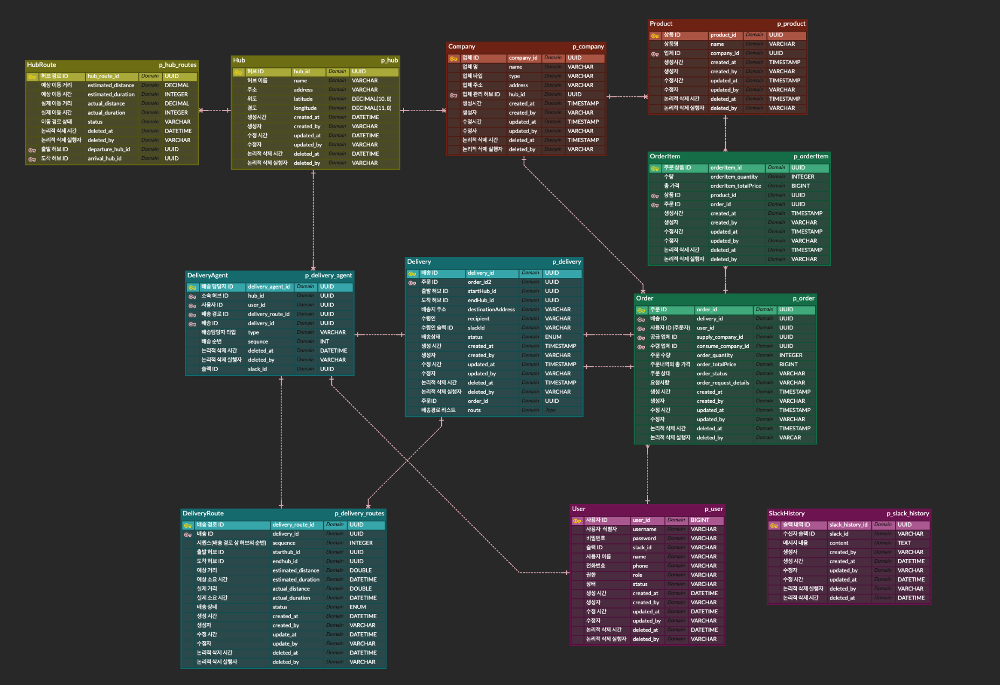

---

## 🔞 18th-Street Logistics

### 👤 팀 명: 18번가

|                   김도연                    |                 김은수                  |                     박종민                      |                       윤 관                        |
|:----------------------------------------:|:------------------------------------:|:--------------------------------------------:|:------------------------------------------------:|
| [@Yeonnnny](https://github.com/Yeonnnny) | [@kizzis](https://github.com/kizzis) | [@codejomo99](https://github.com/codejomo99) | [@dominic-yoon](https://github.com/dominic-yoon) |
|     User(Auth, JWT), Slack, Gateway      |       Company, Product, Order        |   Delivery, Delivery-Agent, Delivery-Route   |                  Hub, Hub-Route                  |

---

## 🚩 프로젝트 목적 / 상세

> * MSA 기반 국내 물류 관리 및 배송 시스템 개발
> * 허브-앤-스포크(Hub and Spoke) 모델을 기반으로 한 B2B 배송 최적화 플랫폼

- API Gateway 및 Eureka 기반 마이크로서비스 구조
- Zipkin 기반 분산 추적
- 물류센터(Hub) 관리
- 배송 기사 / 배송 경로 관리
- 상품 / 업체 / 주문 관리
- 슬랙 연동 알림

## 🏛️ 서비스 구성 및 실행 방법

## 🧬 ERD

> PostgreSQL 기반 ERD

## 🛠 기술 스택

## 💡 트러블 슈팅 / 핵심 고민

### ✅ RabbitMQ 메세지 무한 재 큐잉 문제

> **문제 상황**
>   * 배송 서비스가 메시지를 제대로 처리한 후에도 동일한 메세지가 계속해서 큐에 재큐잉 되며 무한 루프가 발생함.
>   * 기존에 배송 생성 이벤트를 수신하는 @RabbitListener에서 다음과 같은 코드로 작성되어 있었음.
>
> **원인 분석**
>   * RabbitMQ의 ACK 정책을 보면, RabbitMQ는 메세지가 소비자에 의해 명시적으로 ACK(승인) 되거나 NACK(거부) 되지 않으면, 기본적으로 메세지를 재배달함.
>   * 즉, 반환 값이 있는 경우, Spring AMQP가 메세지를 자동으로 ACK 하지 않아서 재큐잉이 발생한 것으로 판단.
>
> **해결 방법**
>   * 반환 타입을 void로 수정
>   * 메세지가 무한히 재 큐잉되며 시스템의 부하를 주는 것을 없앰

### 💡 로그아웃 기능

> 로그아웃이 완료된 사용자의 access token을 인메모리에 저장해 해당 토큰으로 접근 시 gateway에서 차단되도록 인증 기능 구현

### 💡 권한 검사

> MSA 환경에서 각 마이크로 서비스마다 요청 API 별 role에 따른 권한 검사를 위한 @CheckRole 어노테이션 구현

### 💡 Hub and Spoke 최단 경로 계산

>

### 💡 지능형 배차 시스템

> * 라운드 로빈 기반의 지능형 배차 시스템으로, 허브 배달일 경우 허브 담당자를 우선 배정하고 부족 시 업체 담당자를 활용합니다.
> * 반대로 업체 배달일 경우 업체 배달 담당자 우선으로 배정하고 부족 시 허브 담당자를 활용합니다.

### 💡 주문 생성 및 취소 비동기 처리

> * RabbitMQ를 사용해 주문 생성과 취소를 비동기 방식으로 처리하여 주문 처리 시간을 단축
> * 주문 조회와 삭제는 동기 방식으로 처리하여 빠른 응답과 데이터 일관성 유지

### 💡 상품 조회 성능 개선

> * Redis를 활용하여 자주 조회되는 상품 정보를 캐싱하여 FeignClient 호출 속도를 개선
> * 상품 조회 외에도 다른 기능에 캐싱을 적용하여 최신 데이터를 유지

## 📄 API Docs

> Swagger UI를 통해서 각 서비스 API 문서를 제공합니다.

