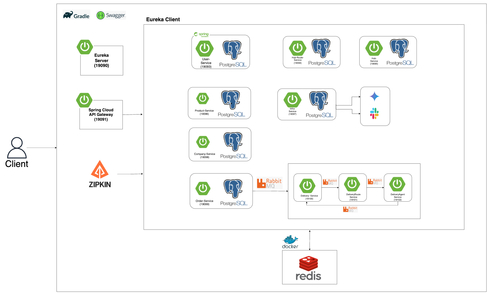
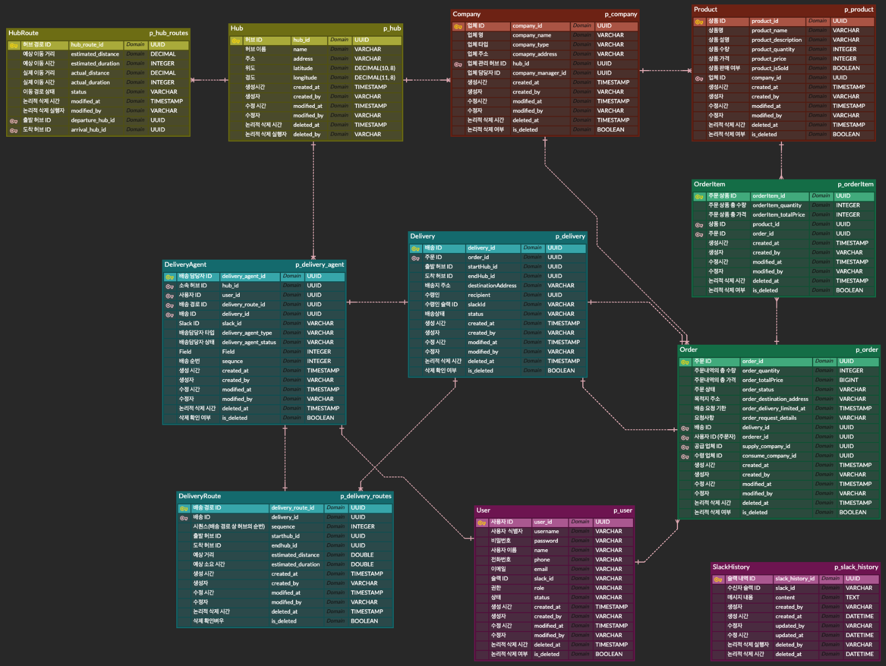
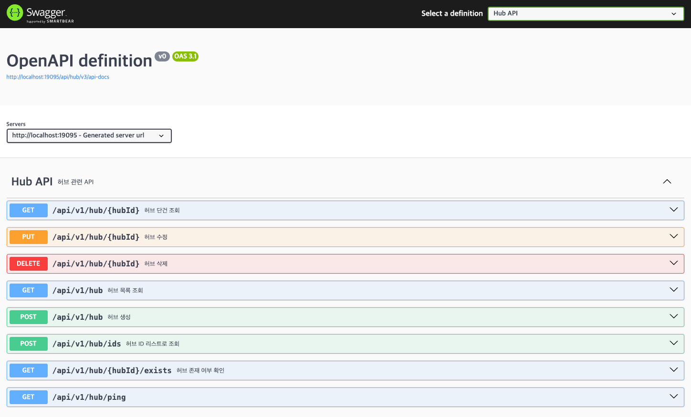

---

## 🔞 18th-Street Logistics

### 👤 팀 명: 18번가

|                   김도연                    |                 김은수                  |                     박종민                      |                       윤 관                        |
|:----------------------------------------:|:------------------------------------:|:--------------------------------------------:|:------------------------------------------------:|
| [@Yeonnnny](https://github.com/Yeonnnny) | [@kizzis](https://github.com/kizzis) | [@codejomo99](https://github.com/codejomo99) | [@dominic-yoon](https://github.com/dominic-yoon) |
|     User(Auth, JWT), Slack, Gateway      |       Company, Product, Order        |   Delivery, Delivery-Agent, Delivery-Route   |                  Hub, Hub-Route                  |

---

## 🚩 프로젝트 목적 / 상세

### B2B 물류 관리 및 배송 시스템 구축을 위한 MSA 기반 플랫폼 개발

> 이번 프로젝트의 주요 목표는 MSA(Microservices Architecture) 구조를 기반으로,
> 전국 단위 물류 센터(Hub)와 배송 경로를 효율적으로 관리하는 물류/배송 최적화 시스템을 개발하는 것입니다.

### 주요 목적

> * 실제 물류 프로세스를 반영한 허브 간 경로 및 배송 처리 기능 구현
> * Hub-and-Spoke 모델 기반의 배송 네트워크 최적화
> * Slack 연동을 통한 실시간 배송 정보 알림 제공
> * Spring Cloud 기반의 MSA 환경 구성 (Eureka, Gateway, Config, Zipkin 등)
> * Redis, RabbitMQ, Swagger 등 다양한 기술 스택 적용

### 시스템 특징

> **허브(Hub) 관리 기능**
> * 전국 17개 광역시·도에 위치한 물류센터의 CRUD 및 검색 기능을 제공하며, 캐싱 및 논리 삭제 전략을 통해 성능과 데이터 일관성을 고려함

> **Hub-to-Hub 경로 탐색 기능**
> * 허브 간 배송 경로를 BFS 알고리즘 기반으로 최단 경로 탐색을 구현. Hub-and-Spoke 모델 특성상 중앙 허브(경기남부, 대전, 대구)를 거쳐 배송됨

> **지능형 배송 담당자 배정 시스템**
> * 배송 요청 시 라운드 로빈 기반으로 허브/업체 배송담당자를 자동 배정

> **Slack 메시지 알림 시스템**
> * 주문 생성 시 AI(Gemini API)를 활용하여 최종 발송 시점을 계산하고, Slack 메시지로 자동 알림 전송

> **MSA 핵심 기술 스택 적용**
> * Spring Boot 기반 각 마이크로서비스
> * Eureka로 서비스 디스커버리 관리
> * API Gateway로 요청 라우팅 및 인증 처리
> * Zipkin으로 분산 추적 적용
> * Redis로 데이터 캐싱 처리
> * RabbitMQ로 주문/배송 처리의 비동기화

## 🏛️ 서비스 구성



## 🧬 ERD

> PostgreSQL 기반 ERD



## 🛠 기술 스택

<div style="display: flex; justify-content: center;">
  
  
  
  
  
</div>

<div style="display: flex; justify-content: center;">
  
  
  
  

  
</div>

## 💡 트러블 슈팅 / 핵심 고민

### ✅ RabbitMQ 메세지 무한 재 큐잉 문제

> **문제 상황**
>   * 배송 서비스가 메시지를 제대로 처리한 후에도 동일한 메세지가 계속해서 큐에 재큐잉 되며 무한 루프가 발생함.
>   * 기존에 배송 생성 이벤트를 수신하는 @RabbitListener에서 다음과 같은 코드로 작성되어 있었음.
>
> **원인 분석**
>   * RabbitMQ의 ACK 정책을 보면, RabbitMQ는 메세지가 소비자에 의해 명시적으로 ACK(승인) 되거나 NACK(거부) 되지 않으면, 기본적으로 메세지를 재배달함.
>   * 즉, 반환 값이 있는 경우, Spring AMQP가 메세지를 자동으로 ACK 하지 않아서 재큐잉이 발생한 것으로 판단.
>
> **해결 방법**
>   * 반환 타입을 void로 수정
>   * 메세지가 무한히 재 큐잉되며 시스템의 부하를 주는 것을 없앰

### 💡 로그아웃 기능

> 로그아웃이 완료된 사용자의 access token을 인메모리에 저장해 해당 토큰으로 접근 시 gateway에서 차단되도록 인증 기능 구현

### 💡 권한 검사

> MSA 환경에서 각 마이크로 서비스마다 요청 API 별 role에 따른 권한 검사를 위한 @CheckRole 어노테이션 구현

### 💡 Hub and Spoke 최단 경로 계산

> * Hub and Spoke 방식을 사용했기에 일반 허브는 각 지역의 중앙 허브에만 연동이 되어있고, 중앙 허브는 중앙 허브끼리 연동이 되었다.
> * 각 허브는 무조건 하나 이상의 허브에 연결이 되어있으므로 최단 경로를 구하는 방법으로 경로를 구해야 한다.
> * 그러므로 **너비 우선 탐색(BFS)** 알고리즘을 사용하여 구현 하였습니다.

### 💡 지능형 배차 시스템

> * 라운드 로빈 기반의 지능형 배차 시스템으로, 허브 배달일 경우 허브 담당자를 우선 배정하고 부족 시 업체 담당자를 활용합니다.
> * 반대로 업체 배달일 경우 업체 배달 담당자 우선으로 배정하고 부족 시 허브 담당자를 활용합니다.

### 💡 주문 생성 및 취소 비동기 처리

> * RabbitMQ를 사용해 주문 생성과 취소를 비동기 방식으로 처리하여 주문 처리 시간을 단축
> * 주문 조회와 삭제는 동기 방식으로 처리하여 빠른 응답과 데이터 일관성 유지

### 💡 상품 조회 성능 개선

> * Redis를 활용하여 자주 조회되는 상품 정보를 캐싱하여 FeignClient 호출 속도를 개선
> * 상품 조회 외에도 다른 기능에 캐싱을 적용하여 최신 데이터를 유지

## 📄 API Docs

> * Swagger UI를 통해서 각 서비스 API 문서를 제공합니다.
> * 각 서비스를 실행 시킨뒤, Gateway Service(19091포트)에 접속하여 API Docs 확인

```bash
# 루트에서 전체 서비스 실행
docker-compose up --build
```




